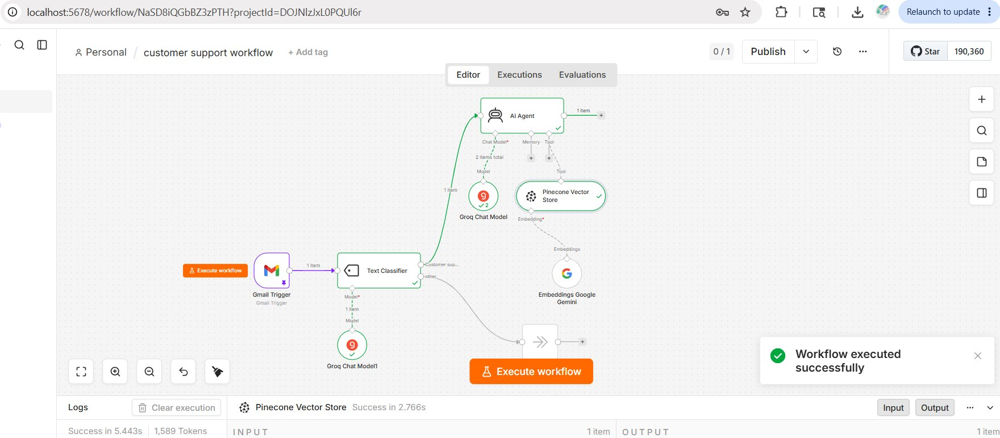

# 🎧 Customer Support Workflow (v2)

> A **fully free, AI-powered email triage system** built in n8n that watches your Gmail inbox, classifies incoming emails using Groq, routes customer support queries to a RAG-powered AI Agent backed by Pinecone, and ignores everything else — all at zero cost.

---

## 📸 Workflow Overview



---

## 💡 What It Does

Every new email that hits your Gmail inbox is automatically processed. A **Text Classifier** (powered by Groq) reads it and decides if it's a customer support request or not. Support emails go to an **AI Agent** that searches your **Pinecone knowledge base** using **Google Gemini Embeddings** and generates a grounded response. Non-support emails are silently ignored.

```
New email arrives in Gmail
        ↓
Text Classifier (Groq)
        ↓                    ↓
Customer Support?          Other?
        ↓                    ↓
    AI Agent (Groq)      No Operation
  + Pinecone RAG          (do nothing)
  + Gemini Embeddings
```

---

## 🏗️ Architecture

```
Gmail Trigger
    ↓
Text Classifier
    ├── Groq Chat Model1 (classifier brain)
    │
    ├── [Customer support...] ──→ AI Agent
    │                               ├── Groq Chat Model (agent brain)
    │                               └── Pinecone Vector Store (retrieval tool)
    │                                       └── Embeddings Google Gemini
    │
    └── [Other] ──→ No Operation, do nothing
```

---

## 🔧 Tech Stack

| Component | Purpose | Cost |
|---|---|---|
| **n8n** | Workflow automation platform | Free tier |
| **Gmail Trigger** | Watches inbox for new emails | Free |
| **Text Classifier** | Classifies email intent — support or other | Free (uses Groq) |
| **Groq Chat Model1** | Powers the Text Classifier | Free tier |
| **Groq Chat Model** | Powers the AI Agent's reasoning and response | Free tier |
| **Pinecone Vector Store** | Stores and retrieves knowledge base embeddings | Free tier |
| **Embeddings Google Gemini** | Converts queries to vectors for semantic search | Free tier |

> 💸 **Total cost to run: $0.** This version replaces OpenAI with Groq + Gemini Embeddings, making the entire stack free.

---

## 🗂️ Node Breakdown

| Node | Type | Role |
|---|---|---|
| **Gmail Trigger** | Trigger | Fires when a new email arrives in Gmail |
| **Text Classifier** | Classifier | Reads the email and routes it to the right path |
| **Groq Chat Model1** | Chat Model | Powers the Text Classifier's classification logic |
| **AI Agent** | AI Agent | Handles customer support emails using RAG |
| **Groq Chat Model** | Chat Model | Powers the AI Agent's response generation |
| **Pinecone Vector Store** | Tool | Performs semantic search on the knowledge base |
| **Embeddings Google Gemini** | Embeddings | Converts the email into a vector for Pinecone search |
| **No Operation, do nothing** | Utility | Catches non-support emails — workflow ends silently |

---

## 🚀 Example Flow

**Scenario:** A customer emails: *"I can't log into my account, it keeps saying invalid password."*

1. **Gmail Trigger** detects the new email
2. **Text Classifier** reads subject + body → classifies as `Customer support`
3. Routes to **AI Agent**
4. **Embeddings Google Gemini** converts the email into a vector
5. **Pinecone Vector Store** finds the most relevant chunks (e.g. login troubleshooting docs)
6. **Groq Chat Model** reads the retrieved context and generates a helpful reply
7. Response output is ready for sending

⏱️ *Executed successfully in 5.443s — 1,589 tokens used (confirmed in logs)*

---

**Scenario:** A promotional newsletter arrives.

1. **Gmail Trigger** detects the new email
2. **Text Classifier** reads it → classifies as `Other`
3. Routes to **No Operation** → workflow ends silently, nothing happens

---

## ✅ Execution Stats (from logs)

| Metric | Value |
|---|---|
| Total execution time | 5.443s |
| Tokens used | 1,589 |
| Pinecone retrieval time | 2.766s |
| Status | ✅ Workflow executed successfully |

---

## 🧩 Key Concepts

**1. Groq = Fast + Free**
Groq's free tier runs Llama 3.3 70B at extremely high speed. Both the classifier and the agent use Groq, making this entire workflow completely free to run.

**2. Gemini Embeddings = Free Semantic Search**
Instead of paying for OpenAI embeddings, this version uses Google Gemini Embeddings — also free. The embedding model converts the email content into a vector so Pinecone can find the most relevant knowledge base chunks.

**3. Text Classifier as a Smart Router**
The classifier doesn't use keyword matching. It uses an LLM to understand the intent of the email. You can extend it with more categories (Billing, Refund, Technical) to route to different specialist agents.

**4. RAG Grounds Every Answer**
The AI Agent doesn't answer from general knowledge. It always retrieves relevant content from Pinecone first, then generates a response based on your actual documentation — reducing hallucination to near zero.

**5. No Operation = Clean Workflow Design**
Non-support emails exit gracefully through the No Operation node. No errors, no noise in logs — just a clean silent exit.

---

## ⚠️ Known Gotchas

| Issue | Fix |
|---|---|
| **Groq rate limits** | Free tier allows ~12,000 tokens/min. For high inbox volume, add a Wait node between executions |
| **Gemini embedding dimension mismatch** | Ensure your Pinecone index was created with the correct dimensions for Gemini's embedding model |
| **Classifier mislabels emails** | Add more example phrases to the classifier prompt to cover edge cases |
| **No reply node connected** | The workflow generates a response but doesn't send it yet — add a Gmail Reply node after the AI Agent |
| **Empty Pinecone results** | Your knowledge base may not be ingested yet — run the ingestion pipeline first to populate Pinecone |

---

## 🔧 Recommended Next Nodes

The workflow currently generates a response but doesn't send it. Add these to complete the loop:

```
AI Agent
    ↓
Gmail: Reply to Thread       ← sends the AI response back to the customer
    ↓
Gmail: Add Label "AI Handled" ← marks the email as processed
    ↓
(Optional) Google Sheets: Log ← logs ticket details for reporting
```

---

## 🆚 v1 vs v2 Comparison

| Feature | v1 (Previous) | v2 (This version) |
|---|---|---|
| Classifier model | OpenAI | **Groq (free)** |
| Agent model | OpenAI | **Groq (free)** |
| Embeddings | OpenAI | **Google Gemini (free)** |
| Total cost | ~Paid | **$0** |
| Speed | Fast | **Faster (Groq)** |

---

## 🛠️ Skills Used

| Skill | Description |
|---|---|
| **Prompt Engineering** | Writing classifier and agent system prompts for accurate routing and grounded responses |
| **RAG Architecture** | Connecting Pinecone vector search to an AI Agent for knowledge-based answers |
| **Workflow Automation** | Building event-driven email pipelines in n8n |
| **Email Automation** | Triggering and processing Gmail messages automatically |
| **Vector Database Management** | Using Pinecone with Gemini embeddings for semantic retrieval |

---

## 🌱 What You Can Build Next

| Project | Description |
|---|---|
| **Multi-category Support Router** | Add Billing, Refund, and Technical categories — route each to a specialist agent |
| **Auto-Reply System** | Add a Gmail Reply node to close the loop and send responses automatically |
| **Support Ticket Logger** | Log every support email and AI response to Google Sheets for analytics |
| **Slack Notification** | Ping a Slack channel when a high-priority support email is detected |
| **Sentiment Triage** | Add a sentiment analysis step to flag angry customers for human escalation |

---

## 📄 License

MIT — free to use, modify, and build upon.

---

*Built with n8n · Gmail · Groq · Pinecone · Google Gemini Embeddings · Zero dollars 🚀*
