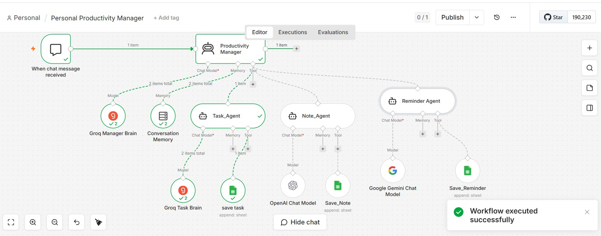

# 🧠 Personal Productivity Manager

> A **Multi-Agent AI System** built in n8n that automatically classifies your messages and saves them to the right place — tasks, notes, or reminders — using a Manager + Specialists pattern.

---

## 📸 Workflow Overview



---

## 💡 What It Does

You type one casual sentence in chat. Behind the scenes, a **Manager Agent** reads it, decides what type of content it is, and delegates it to the right **Specialist Agent**, which saves it neatly to your Google Sheet.

```
You type → Manager decides → Specialist saves → You get confirmation
```

---

## 🏗️ Architecture

```
Chat Trigger
    ↓
Manager Agent (Productivity Manager)
    ↓              ↓                  ↓
Task Agent    Note Agent     Reminder Agent
    ↓              ↓                  ↓
Tasks tab     Notes tab      Reminders tab
           (Google Sheets)
```

### The 4 Agents

| Agent | Role | Triggers |
|---|---|---|
| **Manager** | Orchestrates — reads input, delegates to the right specialist | Every message |
| **Task Agent** | Extracts to-do items with priority (High/Medium/Low) | "I need to…", "add task…", "to-do…" |
| **Note Agent** | Creates titled notes from ideas or information | "note that…", "idea:", "remember that…" |
| **Reminder Agent** | Parses time-based reminders with date & time resolution | "remind me at/on/by [time/date]" |

---

## 🔧 Tech Stack

| Component | Purpose | Cost |
|---|---|---|
| **n8n** | Workflow automation platform | Free tier |
| **Groq (Llama 3.3 70B)** | AI brain for Manager & Task agents | Free tier |
| **OpenAI** | AI brain for Note Agent | Free tier |
| **Google Gemini** | AI brain for Reminder Agent | Free tier |
| **Google Sheets** | Storage for all three data types | Free |
| **Window Buffer Memory** | Remembers last 10 messages for context | Built-in (free) |

> 💸 **Total cost to run: $0.** This project proves you can build powerful AI systems without paying for OpenAI.

---

## 🗂️ Google Sheets Structure

### Tasks Tab
| Date | Task | Priority | Status |
|---|---|---|---|
| 2026-05-29 | Call the client | High | Pending |

### Notes Tab
| Date | Topic | Note |
|---|---|---|
| 2026-05-29 | Project Idea | Full note content here... |

### Reminders Tab
| Created | Reminder | Due_Date | Due_Time |
|---|---|---|---|
| 2026-05-29 | Call mom | 2026-05-30 | 17:00 |

---

## 🔢 Node List (15 Nodes)

**Triggers & Orchestration (3)**
- Chat Trigger
- Productivity Manager (Manager Agent)
- Conversation Memory

**AI Brains — one per agent (4)**
- Groq Manager Brain
- Groq Task Brain
- OpenAI Chat Model (Note Agent)
- Google Gemini Chat Model (Reminder Agent)

**Sub-Agents (3)**
- Task_Agent
- Note_Agent
- Reminder_Agent

**Storage Tools (3)**
- save task → appends to Tasks tab
- Save_Note → appends to Notes tab
- Save_Reminder → appends to Reminders tab

---

## 🚀 Example Flow

**Input:** `"remind me to call mom tomorrow at 5pm"`

1. **Chat Trigger** catches the message
2. **Manager Agent** detects "remind me" + time → delegates to Reminder Agent
3. **Reminder Agent** extracts:
   - Reminder: `"call mom"`
   - Due_Date: `"2026-05-30"` *(resolves "tomorrow" automatically)*
   - Due_Time: `"17:00"` *(converts 5pm to 24-hour format)*
4. **Save_Reminder** appends a new row to Google Sheets
5. **Manager** returns: `"Reminder set: call mom on 2026-05-30 at 17:00"`

⏱️ *All of this happens in ~2 seconds.*

---

## ⚠️ Known Gotchas

| Issue | Fix |
|---|---|
| **Sheet column mismatch** | Column headers in Google Sheets must match exactly (case-sensitive, underscores not hyphens) |
| **Groq rate limits** | Free tier allows ~12,000 tokens/min. Wait 30 seconds between heavy test runs |
| **Wrong sub-agent called** | Sharpen the Manager's system prompt — add more examples and clearer rules |
| **"Sheet not found" error** | Tab names are case-sensitive. Verify they match exactly what the agents expect |

---

## 🧩 Key Concepts

1. **Multi-Agent = Specialists working together** — smaller, focused agents outperform one giant prompt
2. **AI Agent Tool Node** — n8n's pattern that puts everything on one canvas instead of separate sub-workflows
3. **System prompt is the magic** — the Manager has no code logic; it just follows a well-written prompt
4. **`$fromAI()`** — how agents dynamically pass values to their tools (e.g., extracting due dates from natural language)
5. **Window Buffer Memory** — gives the agent short-term memory so users can say "make that urgent" naturally

---

## 🌱 What You Can Build Next

The **manager + specialists pattern** is reusable. Just swap the specialists:

- **Customer Support Triage** → Refund Agent, Tech Support Agent, General Inquiry Agent
- **Content Creator Assistant** → Caption Writer, Hashtag Generator, Idea Generator
- **Smart Expense Manager** → Logger, Reporter, Budget Advisor
- **Study Buddy** → Quiz Maker, Concept Explainer, Text Summarizer

> *The pattern stays the same. Only the specialists change.*

---

## 📄 License

MIT — free to use, modify, and build upon.

---

*Built with n8n · Groq · Google Sheets · Zero dollars 🚀*
