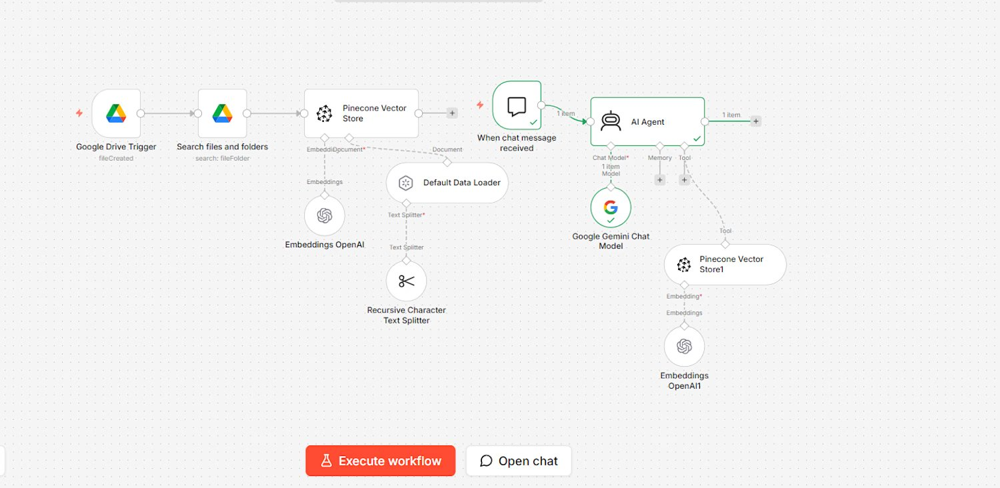

# 📚 RAG Pipeline — Google Drive to AI Chat

> A **Retrieval-Augmented Generation (RAG) system** built in n8n that automatically ingests documents from Google Drive, embeds them into a Pinecone vector store, and lets you chat with your documents using an AI Agent powered by Google Gemini.

---

## 📸 Workflow Overview



---

## 💡 What It Does

There are **two pipelines** in one workflow:

1. **Ingestion Pipeline** — Automatically triggered when a new file is added to Google Drive. It loads the document, splits it into chunks, generates embeddings, and stores them in Pinecone.

2. **Query Pipeline** — When you ask a question in chat, the AI Agent searches Pinecone for relevant document chunks, retrieves them, and uses Gemini to generate a grounded, accurate answer.

```
NEW FILE ADDED                    YOU ASK A QUESTION
      ↓                                   ↓
Google Drive Trigger             Chat Trigger
      ↓                                   ↓
Search Files & Folders           AI Agent (Gemini)
      ↓                                   ↓
Pinecone Vector Store        Pinecone Vector Store1
      ↓                          (semantic search)
Default Data Loader                        ↓
      ↓                          Embeddings OpenAI1
Recursive Text Splitter                    ↓
      ↓                            Answer returned
Embeddings OpenAI                  back to user
      ↓
Stored in Pinecone
```

---

## 🏗️ Architecture

### Pipeline 1 — Document Ingestion

```
Google Drive Trigger (fileCreated)
    ↓
Search Files and Folders
    ↓
Pinecone Vector Store (write)
    ├── Default Data Loader
    ├── Recursive Character Text Splitter
    └── Embeddings OpenAI
```

### Pipeline 2 — Chat & Retrieval

```
When Chat Message Received
    ↓
AI Agent
├── Google Gemini Chat Model (brain)
└── Pinecone Vector Store1 (retrieval tool)
        └── Embeddings OpenAI1
```

---

## 🔧 Tech Stack

| Component | Purpose | Cost |
|---|---|---|
| **n8n** | Workflow automation platform | Free tier |
| **Google Drive** | Document source — watches for new files | Free |
| **Pinecone** | Vector database — stores and retrieves embeddings | Free tier |
| **OpenAI Embeddings** | Converts text chunks into vector embeddings | Paid (low cost) |
| **Google Gemini** | AI brain for the chat agent | Free tier |
| **Default Data Loader** | Loads file content from Google Drive | Built-in |
| **Recursive Character Text Splitter** | Splits documents into overlapping chunks for better retrieval | Built-in |

---

## 🗂️ Node Breakdown

### Ingestion Pipeline
| Node | Role |
|---|---|
| **Google Drive Trigger** | Fires when a new file is created in the watched folder |
| **Search Files and Folders** | Locates and retrieves the newly added file |
| **Pinecone Vector Store** | Writes embedded chunks into the Pinecone index |
| **Default Data Loader** | Parses and loads the raw document content |
| **Recursive Character Text Splitter** | Splits content into smaller overlapping chunks for better semantic search |
| **Embeddings OpenAI** | Generates vector embeddings for each chunk |

### Query Pipeline
| Node | Role |
|---|---|
| **When chat message received** | Entry point — catches the user's question |
| **AI Agent** | Orchestrates retrieval and response generation |
| **Google Gemini Chat Model** | Powers the AI Agent's reasoning and answer generation |
| **Pinecone Vector Store1** | Performs semantic search to find relevant chunks |
| **Embeddings OpenAI1** | Converts the user's question into a vector for similarity search |

---

## 🚀 Example Flow

**Scenario:** You upload a 20-page PDF report to Google Drive, then ask a question about it.

### Ingestion (automatic):
1. **Google Drive Trigger** detects the new file
2. **Search Files and Folders** retrieves it
3. **Default Data Loader** extracts the text
4. **Recursive Text Splitter** breaks it into chunks (e.g. 500 tokens each, with overlap)
5. **Embeddings OpenAI** converts each chunk into a vector
6. **Pinecone Vector Store** saves all vectors to the index

### Query:
1. You type: *"What were the key findings in the report?"*
2. **AI Agent** receives the question
3. **Embeddings OpenAI1** converts the question into a vector
4. **Pinecone Vector Store1** finds the most semantically similar chunks
5. **Gemini** reads the retrieved chunks and generates a precise answer
6. Answer is returned to you in chat

---

## 🧩 Key Concepts

**1. RAG = Retrieval + Generation**
Instead of relying on the LLM's training data, RAG fetches the actual relevant content from your documents first, then generates an answer grounded in that content. This eliminates hallucination and keeps answers accurate.

**2. Chunking Strategy Matters**
The Recursive Character Text Splitter breaks documents into overlapping chunks. Overlap ensures context isn't lost at chunk boundaries. Chunk size affects both retrieval quality and cost.

**3. Embeddings = Semantic Understanding**
OpenAI embeddings convert text into numerical vectors. Similar meaning = similar vectors. This is what allows Pinecone to find relevant chunks even when the exact words don't match the query.

**4. Two Separate Pinecone Nodes**
One node is used for **writing** (ingestion pipeline) and another for **reading** (query pipeline). Same index, different operations.

**5. Automatic Ingestion**
The Google Drive Trigger means you never have to manually re-run the ingestion. Drop a file in the folder → it's instantly searchable.

---

## ⚠️ Known Gotchas

| Issue | Fix |
|---|---|
| **Embeddings cost** | OpenAI embeddings are not free. For a zero-cost alternative, swap to a local embedding model or use Gemini embeddings |
| **Pinecone index dimension mismatch** | The index dimensions must match the embedding model output (OpenAI `text-embedding-3-small` = 1536 dimensions) |
| **Large files slow ingestion** | Very large documents take longer to chunk and embed. Consider filtering file types in the Drive trigger |
| **Stale data in Pinecone** | If a file is updated in Drive, the old chunks remain in Pinecone. Add a delete-and-re-embed step for updates |
| **No memory on AI Agent** | Currently no memory node is connected to the AI Agent. Add a Simple Memory node for multi-turn conversations |

---

## 🛠️ Skills Used

| Skill | Description |
|---|---|
| **RAG Architecture** | Designing a two-pipeline system for ingestion and retrieval |
| **Vector Database Management** | Storing, indexing, and querying embeddings in Pinecone |
| **Prompt Engineering** | Guiding the AI Agent to answer only from retrieved context |
| **Workflow Automation** | Connecting triggers, loaders, splitters, and APIs in n8n |
| **Document Processing** | Chunking and embedding unstructured documents for semantic search |

---

## 🌱 What You Can Build Next

| Project | Description |
|---|---|
| **Company Knowledge Base** | Upload internal docs — HR policies, SOPs, product manuals — and chat with them |
| **Personal Research Assistant** | Drop research papers into Drive and get instant Q&A |
| **Customer Support Bot** | Ingest your FAQ and documentation, answer support tickets automatically |
| **Legal Document Analyzer** | Upload contracts and ask questions about clauses, dates, and obligations |
| **Study Assistant** | Upload lecture notes and textbooks, quiz yourself conversationally |

---

## 📄 License

MIT — free to use, modify, and build upon.

---

*Built with n8n · Google Drive · Pinecone · OpenAI Embeddings · Google Gemini 🚀*
